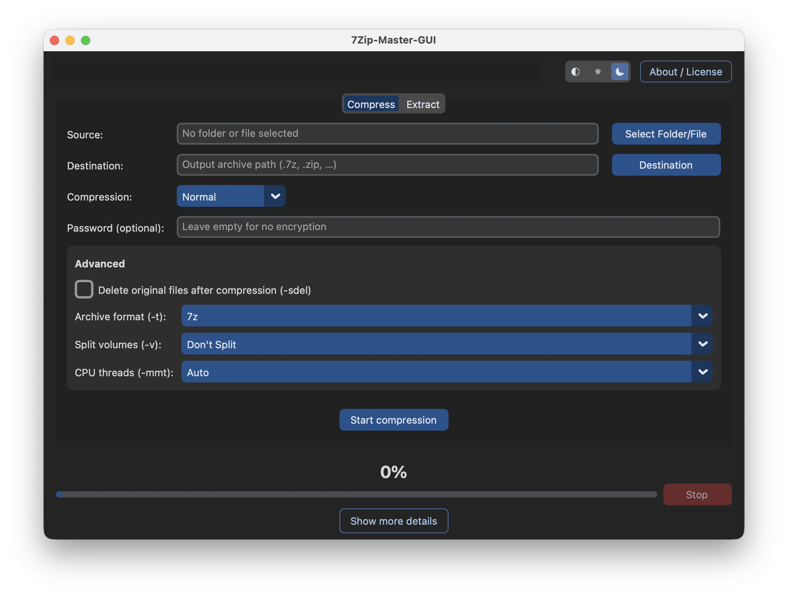
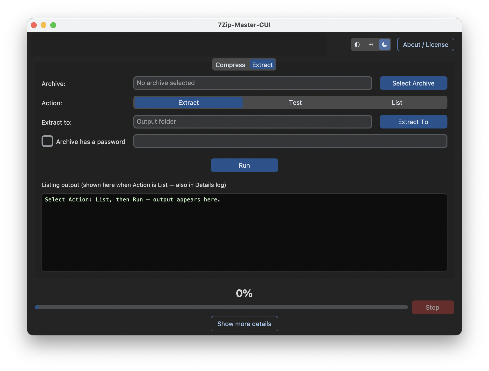

# 7-Zip Master GUI for macOS

A clean, native, and fast macOS frontend for the 7-Zip (`7zz`) command-line compression tool. Built with Python and CustomTkinter, it brings the power of 7-Zip's advanced archive management to a sleek, dark-mode focused GUI.




## Features

* **Apple Silicon Native:** Fully optimized for M-series processors (M1 through M4) for maximum compression speeds and multi-threading.
* **Advanced Compression:** Exposes power-user switches like delete-after-compression (`-sdel`), split volumes (`-v`), and CPU thread controls (`-mmt`).
* **Format Flexibility:** Easily create `.7z`, `.zip`, and `.tar` archives.
* **Archive Inspection:** Includes "Test" and "List" actions to verify and inspect archive contents directly in the UI without extracting them.
* **Secure Encryption:** AES-256 password protection for both compression and extraction.
* **Dynamic Theming:** Seamlessly toggle between System, Light, and Dark modes using the native macOS-style segmented control.
* **Asynchronous Execution:** Heavy workloads run on background threads, ensuring the UI remains perfectly responsive without "beachballing."

## Download & Installation

1. Go to the **[Releases](../../releases)** page.
2. Download the latest `7Zip-Master-GUI.dmg`.
3. Open the `.dmg` and drag the application to your `Applications` folder.

**Note on macOS Gatekeeper:** Because this is an open-source tool, macOS may flag it as an "unidentified developer" on the first run. 
To open it: **Right-click** the app icon in your Applications folder and select **Open**. You only need to do this once.

## Building from Source

If you prefer to compile the app yourself, you can build it using the provided scripts.

### Prerequisites
* Python 3.10+
* Homebrew (for installing packaging tools)
* The official 7-Zip macOS console binary (`7zz`)

### Build Steps
1. Clone the repository.
2. Install the required Python packages: 
   ```bash
   pip install -r requirements.txt